<div align="center">


<br>


# 🌸 KYARA HIGH-TECH

### WhatsApp Bot • AI • Media • RPG • Economy • Games • Groups

<p>
  
  
  
  
  
</p>

> **Mais que um bot. Um ecossistema.**

</div>

---

# 🌸 KYARA HIGH-TECH

A **KYARA HIGH-TECH** é uma plataforma de automação para WhatsApp construída em **Node.js**, organizada de forma modular para reunir comandos, sistemas, menus, jogos, mídia, economia, RPG, ferramentas e recursos de grupo em um único projeto.

A arquitetura do projeto separa responsabilidades entre:

- 🧠 Core
- ⚙️ Features
- 🎮 Games
- 📋 Menus
- 🛰️ API
- 💾 Database
- 🧩 Modules
- 🔧 Utilities
- 🎨 Assets
- 🤖 Sistemas de IA e persona

O projeto utiliza **ES Modules (ESM)** e possui scripts próprios para inicialização, configuração, desenvolvimento e atualização.

---

# ⚡ PRINCIPAIS SISTEMAS

| Sistema | Descrição |
|---|---|
| 💬 WhatsApp | Núcleo de comunicação e processamento das mensagens |
| 🧠 IA | Persona, contexto e conhecimento da Kyara |
| 📥 Downloads | Sistemas de mídia e processamento de URLs |
| ▶️ YouTube | Pesquisa e processamento de conteúdo |
| 🎵 Áudio | Recursos de download/conversão de mídia |
| 🎬 Vídeo | Recursos de download e processamento |
| 📌 Pinterest | Pesquisa e processamento de conteúdo |
| 🎵 TikTok | Recursos relacionados à plataforma |
| 📸 Instagram | Recursos relacionados à plataforma |
| 📘 Facebook | Recursos relacionados à plataforma |
| 🐦 Twitter/X | Recursos relacionados à plataforma |
| 🎮 Games | Diversos jogos integrados ao bot |
| 🐉 RPG | Sistema de RPG e progressão |
| 💰 Economia | Dinheiro, banco, mercado e propriedades |
| ⭐ Level | XP, níveis e rankings |
| 🏆 Ranking | Rankings globais, semanais e por categoria |
| 🖼️ Figurinhas | Sistemas de stickers e pacotes |
| 🛡️ Grupo | Administração e ferramentas de proteção |
| 🧰 Ferramentas | Utilidades e comandos auxiliares |
| 🖥️ Native Flow | Menus e interações nativas |
| 🌐 Browser/API | Interface web e serviços auxiliares |

---

# 🧬 ARQUITETURA

A Kyara possui uma estrutura modular para evitar concentrar toda a lógica em um único arquivo.

```text
KYARA HIGH-TECH
│
├── 🧠 Core
│   ├── contexto.js
│   ├── kyara.js
│   ├── kyaraKnowledge.js
│   ├── orquestrador.js
│   └── persona.js
│
├── ⚙️ Features
│   ├── commandMaintenance.js
│   ├── figbanSystem.js
│   ├── kyaraBrowser.js
│   ├── kyaraGame.js
│   ├── kyaraGameSave.js
│   ├── kyaraMediaCommands.js
│   ├── kyaraMenuHtml.js
│   ├── kyaraSiteCommand.js
│   ├── kyaraSpecialCommands.js
│   ├── kyaraSpecialCommandsLegacy.js
│   ├── levelingControl.js
│   ├── themeStickers.js
│   └── weeklyLevel.js
│
├── 🎮 Games
│   ├── breakout.js
│   ├── calculadora.js
│   ├── dino.js
│   ├── pianorich.js
│   ├── pong.js
│   ├── rich2048.js
│   ├── richdragon.js
│   ├── richflappy.js
│   ├── richmemory.js
│   ├── richmines.js
│   ├── richreaction.js
│   ├── richslots.js
│   ├── richsnake.js
│   ├── richtetris.js
│   ├── richwordle.js
│   └── richxo.js
│
├── 📋 Menus
│   ├── menu.js
│   ├── menu-interactive.js
│   ├── menu-normal.js
│   ├── menu-mode.js
│   ├── menuadm.js
│   ├── menubn.js
│   ├── menudown.js
│   ├── menuedits.js
│   ├── menufig.js
│   ├── menulogo.js
│   ├── menumemb.js
│   ├── menurpg.js
│   ├── menuvip.js
│   └── topcmd.js
│
├── 🧩 Modules
│   ├── atualizacoes.js
│   ├── cases-local.js
│   ├── comando-info.js
│   ├── discordia.js
│   ├── kyaraHtmlGames.js
│   └── ...
│
├── 🛰️ API
│   ├── server.mjs
│   ├── kyara-browser.html
│   └── kyara-tube.html
│
├── 💾 Database
│   ├── economy.json
│   ├── leveling.json
│   ├── leveling-settings.json
│   ├── figban.json
│   ├── commandStats.json
│   ├── global.json
│   └── ...
│
├── 🔧 Utils
│   ├── activeSocket.js
│   ├── autoRestarter.js
│   ├── captchaIndex.js
│   ├── database.js
│   ├── equipment.js
│   ├── helpers.js
│   └── ...
│
├── 🎨 Assets
│
├── connect.js
├── index.js
├── config.json
├── package.json
└── README.md
```

---

# 🧠 CORE

O núcleo concentra os componentes responsáveis pelo funcionamento central da Kyara.

### Principais componentes

**`dados/src/core/kyara.js`**

Núcleo relacionado ao funcionamento da personagem/bot.

**`dados/src/core/persona.js`**

Define a persona utilizada pela Kyara.

**`dados/src/core/contexto.js`**

Responsável pelo contexto utilizado pelos sistemas da Kyara.

**`dados/src/core/kyaraKnowledge.js`**

Camada de conhecimento utilizada pelo sistema.

**`dados/src/core/orquestrador.js`**

Coordena diferentes partes do processamento.

---

# 🤖 IA E PERSONA

A Kyara possui uma camada própria de identidade e processamento.

Arquivos principais:

```text
dados/src/core/kyara.js
dados/src/core/persona.js
dados/src/core/contexto.js
dados/src/core/kyaraKnowledge.js
dados/config/kyara-ia.json
dados/config/kyara-persona.txt
config/ia-local.json
```

Isso permite separar:

- identidade da personagem;
- persona;
- contexto;
- conhecimento;
- configurações relacionadas à IA.

---

# 📥 SISTEMA DE MÍDIA

A camada principal de mídia está centralizada em:

```text
dados/src/features/kyaraMediaCommands.js
```

O módulo possui lógica para:

- pesquisa;
- identificação de URL;
- identificação de plataforma;
- obtenção de informações;
- download de vídeo;
- download de áudio;
- Pinterest;
- cache;
- botões;
- resolução de ações;
- prevenção de duplicação de processamento.

Plataformas contempladas pela camada de mídia incluem:

```text
YouTube
TikTok
Instagram
Facebook
Kwai
Twitter/X
Pinterest
```

---

# ▶️ YOUTUBE

Comandos relacionados ao processamento de conteúdo do YouTube incluem:

```text
/play
/playaudio
/playvideo
/ytmp3
/ytmp4
```

Exemplos:

```text
/play música
```

```text
/playaudio música
```

```text
/playvideo música
```

```text
/ytmp3 URL
```

```text
/ytmp4 URL
```

---

# 📌 PINTEREST

A Kyara possui suporte específico para Pinterest através do sistema de mídia.

Comandos:

```text
/pinterest
/pin
```

Exemplo:

```text
/pinterest anime
```

Ou utilizando uma URL:

```text
/pinterest https://...
```

A implementação está concentrada no módulo:

```text
dados/src/features/kyaraMediaCommands.js
```

---

# 📱 REDES SOCIAIS

A camada de mídia também possui comandos relacionados a diferentes plataformas.

### TikTok

```text
/tiktok
/tiktokaudio
/tiktokvideo
/tiktoksearch
/tiktoks
/ttk
/tkk
```

### Instagram

```text
/instagram
/ig
/igdl
/instavideo
```

### Facebook

```text
/facebook
/fb
/fbdl
/facebookdl
```

### Twitter/X

```text
/twitter
/x
/twt
/xdl
/twitterdl
```

### Kwai

```text
/kwai
```

---

# 🖥️ KYARA BROWSER

A Kyara possui uma camada de browser/interface web.

Arquivos principais:

```text
dados/src/features/kyaraBrowser.js
dados/api/kyara-browser.html
dados/api/kyara-tube.html
dados/api/server.mjs
```

Essa camada permite integrar recursos web à experiência do bot.

---

# 🛰️ API

A API auxiliar está localizada em:

```text
dados/api/server.mjs
```

Interfaces disponíveis no projeto:

```text
dados/api/kyara-browser.html
dados/api/kyara-tube.html
```

Para iniciar a API diretamente:

```bash
cd ~/storage/BKkyara- && node dados/api/server.mjs
```

---

# 🧩 NATIVE FLOW

A Kyara possui uma camada específica para menus e interações nativas.

A estrutura relacionada ao Native Flow fica em:

```text
dados/src/core/nativeFlow/
```

Componentes presentes:

```text
autoButtons.js
kyara-flow-adapter.js
native-flow.js
owner-flow-router.js
owner-flow.js
```

A arquitetura permite separar:

- construção de botões;
- adaptação de fluxo;
- processamento Native Flow;
- fluxo administrativo;
- roteamento de ações.

---

# 📋 MENUS

A Kyara possui vários módulos de menu.

```text
dados/src/menus/
```

Principais menus:

```text
menu.js
menu-interactive.js
menu-normal.js
menu-mode.js
menuadm.js
menubn.js
menudown.js
menuedits.js
menufig.js
menulogo.js
menumemb.js
menurpg.js
menuvip.js
topcmd.js
```

Também existe o sistema:

```text
dados/src/features/kyaraMenuHtml.js
```

que trabalha com menu HTML e registro de jogos.

---

# 🎮 SISTEMA DE JOGOS

A Kyara possui uma coleção de jogos integrados.

Diretório:

```text
dados/src/games/
```

Jogos presentes no projeto:

| Jogo | Arquivo |
|---|---|
| 🧱 Breakout | `breakout.js` |
| 🧮 Calculadora | `calculadora.js` |
| 🦖 Dino | `dino.js` |
| 🎹 Piano | `pianorich.js` |
| 🏓 Pong | `pong.js` |
| 🔢 2048 | `rich2048.js` |
| 🐉 Rich Dragon | `richdragon.js` |
| 🪽 Flappy | `richflappy.js` |
| 🧠 Memory | `richmemory.js` |
| 💣 Mines | `richmines.js` |
| ⚡ Reaction | `richreaction.js` |
| 🎰 Slots | `richslots.js` |
| 🐍 Snake | `richsnake.js` |
| 🧩 Tetris | `richtetris.js` |
| 📝 Wordle | `richwordle.js` |
| ❌⭕ XO | `richxo.js` |

O registro central dos jogos está em:

```text
dados/src/games/index.js
```

---

# 🐉 RPG

O projeto possui um sistema próprio de RPG.

Entre os recursos existentes estão comandos relacionados a:

```text
/rpg
/aventura
/batalha
/bossfight
/classe
/dungeonsolo
/equipar
/evoluirpet
/explorar
/inventario
/inventory
/missao
/meuspets
/quests
/treinar
```

Também existem comandos de estatísticas e gerenciamento:

```text
/diagnosticrpg
/estatisticasrpg
/rpgstatistics
/statsrpg
/resetrpg
/resetrpgglobal
```

O sistema possui componentes próprios para jogos e salvamento.

---

# 💰 ECONOMIA

A Kyara possui uma camada de economia persistente.

O banco principal relacionado ao sistema está em:

```text
dados/database/economy.json
```

Comandos relacionados incluem:

```text
/banco
/daily
/depositar
/saque
/transferir
/trabalhar
/minerar
/farm
/invest
/comprarmercado
/comprarpropriedade
/coletarpropriedades
/mercadoplayer
```

Também existem comandos relacionados a:

```text
dinheiro
impostos
propriedades
mercado
investimentos
trabalho
```

---

# ⭐ LEVEL E XP

A Kyara possui sistema de progressão por XP.

Arquivos principais:

```text
dados/database/leveling.json
dados/database/leveling-settings.json
dados/src/features/levelingControl.js
dados/src/features/weeklyLevel.js
```

Comandos relacionados:

```text
/level
/levels
/levelinfo
/levelmenu
/levelajuda
/leveling
/nivel
/nivelinfo
/nivelmenu
/xplevel
/ranklevel
/rankinglevel
/toplevels
/rankingsemanal
/ranksemanal
/ranksemana
/weeklyrank
```

O sistema também possui controles individuais relacionados ao Level.

---

# 🏆 RANKINGS

Existem diversos sistemas de ranking.

Entre eles:

```text
/globalrank
/topglobal
/toplevels
/topcmds
/topcmd
/toprich
/toprpgglobal
/topsemanal
/rankingsemanal
/weeklyrank
```

Também existem rankings específicos por categorias.

---

# 💡 SISTEMA DE IDEIAS

O projeto possui um sistema de sugestões/ideias integrado ao sistema semanal.

Comandos relacionados:

```text
/caixadeideias
/ideia
/ideias
/ideiastop
/ideiaview
/listasideias
/melhoresideias
/minhasideias
/minhasideia
/sugerir
/sugestao
/suggest
/topideias
/votar
/votarideia
/voteideia
/votoideia
/verideia
```

O sistema está relacionado ao módulo:

```text
dados/src/features/weeklyLevel.js
```

---

# 🎴 FIGBAN

A Kyara possui um sistema próprio de gerenciamento de figurinhas chamado **FigBan**.

Arquivo:

```text
dados/src/features/figbanSystem.js
```

Banco:

```text
dados/database/figban.json
```

O sistema trabalha com contexto de mensagens, mensagens citadas, identificação de stickers e controles específicos.

---

# 🖼️ FIGURINHAS

O projeto possui diversos comandos relacionados a stickers.

Exemplos:

```text
/sticker
/stk
/stk2
/packfig
/stickerpack
/randomsticker
/stickermenu
```

Também existem recursos relacionados a:

```text
figurinhas
pacotes
temas
stickers aleatórios
```

O sistema de temas está em:

```text
dados/src/features/themeStickers.js
```

---

# 🛡️ SISTEMAS DE GRUPO

A Kyara possui uma grande quantidade de ferramentas para administração e proteção de grupos.

Exemplos:

```text
/banir
/kick
/promote
/demote
/mutar
/desmutar
/onlyadm
/antilink
/captcha
/antiflood
/antispam
/blacklist
/blocklist
/whitelistlista
```

Também existem recursos para:

```text
boas-vindas
mensagens de saída
proteção
moderação
controle de comandos
controle de membros
```

---

# 👋 BOAS-VINDAS E SAÍDA

O projeto possui vários comandos para personalização de entrada e saída de membros.

Exemplos:

```text
/boasvindas
/bv
/bv2
/welcome
/welcome2
/welcomemsg
/welcomemsg2
/welcomeimg
/fotobv
/delfotobv
/fotosaida
/imgsaiu
/textsaiu
```

---

# ⚙️ CONTROLE DE COMANDOS

A Kyara possui um sistema próprio de manutenção e controle de comandos.

Arquivos relacionados:

```text
dados/src/features/commandMaintenance.js
dados/src/database/commands-maintenance.json
dados/database/cmdlimit.json
dados/database/cmduserlimits.json
dados/database/commandAliases.json
dados/database/commandStats.json
```

Isso permite trabalhar com:

- limites;
- estatísticas;
- aliases;
- manutenção;
- comandos personalizados;
- comandos VIP;
- controles específicos por usuário.

---

# 👑 ADMINISTRAÇÃO

Existem menus e comandos específicos para administração.

Menu:

```text
dados/src/menus/menuadm.js
```

Comandos relacionados incluem:

```text
/menuadmin
/menuadmins
/ownermenu
/onlyadm
/soadmin
/admin
```

Além disso, existem sistemas específicos de controle do proprietário.

---

# 💎 VIP

A Kyara possui sistemas relacionados a usuários e grupos VIP.

Exemplos:

```text
/vip
/vipinfo
/vipmenu
/vipstats
/premiumlist
/premiumshop
/buypremium
```

Também existem comandos para gerenciamento de VIPs e Premium.

---

# 👥 SUB-BOTS

O projeto possui suporte a sistemas relacionados a sub-bots.

Comandos encontrados incluem:

```text
/subbots
/codigosubbot
/listsubbots
/reconnectsubbot
/delsubbot
/rmsubbot
```

Também existem comandos relacionados a subdonos:

```text
/subdono
/subdonos
/listsubdonos
/rmsubdono
/remsubdono
```

---

# 🧰 FERRAMENTAS

A Kyara possui diversos utilitários.

Exemplos:

```text
/calculadora
/calcular
/clima2
/weather
/weather2
/tempo
/tempo2
/horario
/horamundial
/fuso
/fusohorario
/tradutor
/translator
/lyrics
/curiosidade
/fatocurioso
/frasemotivacional
/motivacao
/versiculo
```

Também existem ferramentas para:

```text
URLs
QR Code
texto
imagens
vídeos
arquivos
informações
```

---

# 🔗 FERRAMENTAS DE URL

O projeto possui vários comandos relacionados a URLs.

Exemplos:

```text
/checkurl
/checklink
/scanlink
/urlscan
/urlsafe
/verificarurl
/tinyurl
/gerarlink
```

---

# 📊 ESTATÍSTICAS

Existem sistemas de estatística para diferentes áreas.

Exemplos:

```text
/statsgrupo
/statsrpg
/estatisticasrpg
/estatisticasvip
/commandStats
/totalcomando
/topcmds
/comandosmaisusados
```

---

# 🗄️ PERSISTÊNCIA

A Kyara utiliza arquivos JSON para armazenar diferentes sistemas.

Exemplos:

```text
dados/database/economy.json
dados/database/leveling.json
dados/database/leveling-settings.json
dados/database/figban.json
dados/database/global.json
dados/database/botState.json
dados/database/commandStats.json
dados/database/commandAliases.json
dados/database/cmdlimit.json
dados/database/cmduserlimits.json
```

A camada de banco/utilidades está relacionada principalmente a:

```text
dados/src/utils/database.js
```

---

# 🔄 SCRIPTS DO PROJETO

Os scripts oficiais definidos no `package.json` são:

| Script | Função |
|---|---|
| `npm start` | Inicia o bot |
| `npm run dev` | Executa em modo desenvolvimento |
| `npm run config` | Abre o sistema de configuração |
| `npm run config:install` | Instala/configura o ambiente |
| `npm run update` | Executa o atualizador do projeto |

---

# 📦 INSTALAÇÃO

## 1. Requisitos

A versão atual do projeto declara:

```text
Node.js >= 20.0.0
npm >= 9.0.0
```

No Termux:

```bash
pkg update -y
```

```bash
pkg upgrade -y
```

```bash
pkg install nodejs git ffmpeg -y
```

Verifique:

```bash
node -v
```

```bash
npm -v
```

---

# 📁 CLONAR O PROJETO

```bash
git clone https://github.com/bakizinho/Kyara-High-Tech.git
```

Entre no projeto:

```bash
cd Kyara-High-Tech
```

---

# 📦 INSTALAR DEPENDÊNCIAS

```bash
npm install
```

---

# ⚙️ CONFIGURAÇÃO

O projeto possui um sistema próprio de configuração.

Execute:

```bash
npm run config
```

Ou:

```bash
npm run config:install
```

---

# 🚀 INICIAR A KYARA

Para iniciar normalmente:

```bash
npm start
```

O script utilizado pelo projeto é:

```text
dados/src/.scripts/start.js
```

---

# 🧪 MODO DESENVOLVIMENTO

Para executar usando Nodemon:

```bash
npm run dev
```

O comando utiliza:

```text
nodemon dados/src/.scripts/start.js
```

---

# 🔄 ATUALIZAR

O projeto possui um script próprio de atualização:

```bash
npm run update
```

Script responsável:

```text
dados/src/.scripts/update.js
```

---

# 🛰️ EXECUTAR DIRETAMENTE

O núcleo também pode ser iniciado diretamente pelo arquivo de conexão, dependendo da finalidade de desenvolvimento:

```bash
node dados/src/connect.js
```

Para a aplicação principal, o fluxo recomendado é:

```bash
npm start
```

---

# 🧪 VERIFICAR SINTAXE

Para verificar um arquivo JavaScript individual:

```bash
node --check caminho/do/arquivo.js
```

Exemplo:

```bash
node --check dados/src/index.js
```

---

# 🧩 TECNOLOGIAS

A Kyara utiliza um conjunto de bibliotecas Node.js para comunicação, mídia, processamento e infraestrutura.

Principais componentes declarados no projeto:

```text
Baileys
Axios
Cheerio
Sharp
FFmpeg
Node Cache
Node Cron
Node WebPMux
ONNX Runtime Web
Pino
QRCode Terminal
WebSocket
YT Channel Info
YT Search
Linkedom
```

---

# 📦 DEPENDÊNCIAS PRINCIPAIS

As dependências atuais incluem:

```text
@hapi/boom
@img/sharp-wasm32
axios
baileys
cheerio
fluent-ffmpeg
linkedom
node-cache
node-cron
node-webpmux
onnxruntime-web
pino
qrcode-terminal
sharp
ws
yt-channel-info
yt-search
```

Dependência de desenvolvimento:

```text
nodemon
```

---

# 🧱 ESTRUTURA DE CONFIGURAÇÃO

Arquivos de configuração importantes:

```text
dados/src/config.json
dados/config/kyara-ia.json
dados/config/kyara-persona.txt
config/ia-local.json
config/menu-adaptativo.json
config/menu-mode.json
```

Esses arquivos concentram configurações específicas do funcionamento do bot.

---

# 🌐 REPOSITÓRIO

Projeto:

```text
https://github.com/bakizinho/Kyara-High-Tech
```

A página do projeto contém o código-fonte e os arquivos relacionados ao desenvolvimento da Kyara.

---

# 📚 COMANDOS

A Kyara possui uma grande quantidade de comandos organizados por sistemas.

Algumas categorias:

### 👤 Usuário

```text
/perfil
/avatarbot
/fotoperfil
/status
/infobot
/botinfo
```

### 🎮 Diversão

```text
/piadas
/cantadas
/choice
/dice
/cartas
/enigma
/trivia
/quiz
```

### 💰 Economia

```text
/banco
/daily
/depositar
/saque
/transferir
/trabalhar
/invest
/minerar
```

### 🎮 RPG

```text
/rpg
/aventura
/batalha
/bossfight
/dungeonsolo
/explorar
/missao
/inventario
/equipar
/treinar
```

### 🎰 Jogos

```text
/slots
/snake
/pong
/dino
/2048
/xo
/memory
/mines
/wordle
/tetris
```

### 📥 Downloads

```text
/play
/playaudio
/playvideo
/ytmp3
/ytmp4
/tiktok
/instagram
/facebook
/kwai
/twitter
/x
/pinterest
/pin
```

### ⭐ Level

```text
/level
/levelinfo
/levelmenu
/leveling
/nivel
/ranklevel
/toplevels
/rankingsemanal
```

### 🛡️ Grupo

```text
/banir
/kick
/promote
/demote
/mutar
/desmutar
/onlyadm
/captcha
/blacklist
/whitelistlista
```

### 🖼️ Figurinhas

```text
/sticker
/stk
/stk2
/packfig
/stickerpack
/randomsticker
/stickermenu
```

---

# 🔐 SEGURANÇA

O projeto possui sistemas voltados para proteção e controle de grupos, incluindo recursos relacionados a:

```text
AntiFlood
AntiSpam
Captcha
Blacklist
Blocklist
Whitelist
Limitação de comandos
Controle de membros
Controle administrativo
```

Os dados de alguns desses sistemas ficam armazenados em:

```text
dados/database/
```

---

# 🎨 IDENTIDADE VISUAL

Os principais recursos visuais da Kyara estão organizados em:

```text
assets/
dados/midias/
```

Entre os recursos visuais principais:

```text
assets/kyara-high-tech.svg
assets/kyara-header.html
assets/kyara-system.svg
dados/midias/menu.jpg
```

A identidade visual segue o conceito:

> 🌸 **KYARA HIGH-TECH**

Misturando estética tecnológica, interface futurista, anime e sistemas interativos.

---

# 🧠 FILOSOFIA DO PROJETO

A Kyara foi estruturada para funcionar como um ecossistema modular.

A ideia central é manter diferentes sistemas separados para facilitar:

```text
desenvolvimento
manutenção
expansão
correção
organização
integração
```

Novos recursos podem ser adicionados dentro das camadas apropriadas sem precisar transformar todo o projeto em um único módulo monolítico.

---

# 🛠️ DESENVOLVIMENTO

Para trabalhar no projeto:

```bash
cd ~/storage/BKkyara-
```

Instale as dependências:

```bash
npm install
```

Execute em desenvolvimento:

```bash
npm run dev
```

Após alterações importantes, pode ser útil verificar a sintaxe do arquivo alterado:

```bash
node --check caminho/do/arquivo.js
```

---

# 📂 MAPA RÁPIDO

```text
📁 KYARA HIGH-TECH
│
├── 📁 assets
│   └── identidade visual
│
├── 📁 config
│   ├── IA
│   ├── menu
│   └── configurações
│
├── 📁 dados
│   ├── 📁 api
│   ├── 📁 config
│   ├── 📁 database
│   ├── 📁 games
│   └── 📁 src
│
├── 📄 package.json
├── 📄 README.md
└── 🔧 scripts auxiliares
```

---

# 🚀 FLUXO DE EXECUÇÃO

O fluxo principal do projeto utiliza os scripts definidos em `package.json`.

```text
npm start
    │
    ▼
dados/src/.scripts/start.js
    │
    ▼
inicialização da aplicação
    │
    ▼
conexão WhatsApp
    │
    ▼
dados/src/index.js
    │
    ├── Core
    ├── Features
    ├── Menus
    ├── Games
    ├── Modules
    └── Utils
```

---

# 🌸 KYARA

A identidade da Kyara não está limitada a um único comando.

Ela combina:

```text
🤖 Automação
🧠 IA
📥 Mídia
🎮 Jogos
🐉 RPG
💰 Economia
⭐ Level
🏆 Rankings
🖼️ Figurinhas
🛡️ Administração
📋 Menus
🛰️ Native Flow
🌐 Browser/API
💾 Persistência
```

---

# 📌 INFORMAÇÕES DO PROJETO

| Informação | Valor |
|---|---|
| Nome | KYARA HIGH-TECH |
| Versão | 10.2.1 |
| Plataforma | WhatsApp |
| Runtime | Node.js |
| Módulos | ES Modules |
| Node mínimo | 20 |
| npm mínimo | 9 |
| Prefixo | `/` |
| Banco | JSON |
| Interface | WhatsApp + Native Flow + Web |
| Desenvolvimento | Termux / Node.js |

---

# 📜 SCRIPTS OFICIAIS

```text
npm start
npm run dev
npm run config
npm run config:install
npm run update
```

---

# ⚠️ OBSERVAÇÕES

A disponibilidade de determinados recursos de mídia pode depender de serviços externos, URLs, disponibilidade das plataformas e do funcionamento das bibliotecas utilizadas pelo projeto.

O sistema deve ser executado em um ambiente compatível com os requisitos declarados no `package.json`.

Não remova arquivos da pasta `dados/database/` sem entender qual sistema utiliza cada banco, pois esses arquivos podem conter dados persistentes de usuários, grupos, economia, Level, estatísticas e configurações.

---

# 🌸 KYARA HIGH-TECH

<div align="center">

### `SYSTEM • MEDIA • RPG • AI • GAMES • GROUPS`

**Uma arquitetura.  
Vários sistemas.  
Uma única identidade.**

<br>



<br><br>

> 🌸 **KYARA HIGH-TECH v10.2.1**

</div>

---

<div align="center">

**Desenvolvido para WhatsApp • Node.js • Termux**

</div>
