# 🌸 KYARA HIGH-TECH v1

<p align="center">
  
</p>

<h1 align="center">KYARA HIGH-TECH</h1>

<p align="center">
  <strong>Um bot WhatsApp moderno, modular e cheio de recursos para Android.</strong>
</p>

<p align="center">
  Desenvolvido em Node.js e executado diretamente pelo Termux.
</p>

<p align="center">
  <a href="https://github.com/bakizinho/Kyara-High-Tech">
    
  </a>
  
  
  
  
</p>

<p align="center">
  <a href="#-sobre-o-projeto">Sobre</a> •
  <a href="#-recursos">Recursos</a> •
  <a href="#-instalação">Instalação</a> •
  <a href="#-conexão-com-o-whatsapp">Conexão</a> •
  <a href="#-comandos">Comandos</a> •
  <a href="#-solução-de-problemas">Problemas</a>
</p>

---

## 🌸 Sobre o projeto

A **KYARA High-Tech v1** é um bot para WhatsApp criado para oferecer uma experiência moderna, prática e personalizável diretamente no Android.

O projeto utiliza **Node.js** e pode ser executado pelo **Termux**, permitindo que você mantenha seu bot funcionando no próprio celular, sem depender obrigatoriamente de uma hospedagem paga.

A KYARA possui uma estrutura modular, permitindo adicionar, corrigir e melhorar sistemas sem precisar reorganizar todo o projeto.

---

## 🚀 Recursos

### 📥 Downloads e mídias

- 🎵 Pesquisa e download de músicas.
- 🎬 Download de vídeos.
- ▶️ Comandos relacionados ao YouTube.
- 🎞️ Suporte para TikTok.
- 📸 Suporte para Instagram.
- 📘 Suporte para Facebook.
- 🦋 Suporte para Kwai.
- 🐦 Suporte para Twitter/X.
- 📌 Suporte para Pinterest.
- 🖼️ Processamento de imagens e vídeos.

### 🎮 Sistemas interativos

- 🌸 Menu principal personalizado.
- ⭐ Sistema de níveis e XP.
- 🎲 Sistemas de diversão.
- 🎮 Recursos de RPG.
- 🧩 Comandos modulares.
- 💬 Respostas personalizadas.
- 📱 Menus interativos para WhatsApp.

### 🛠️ Administração

- 🔐 Ferramentas para grupos.
- 👑 Comandos exclusivos do proprietário.
- ⚙️ Configurações individuais.
- 🚫 Controles administrativos.
- 🛡️ Recursos de proteção para grupos.

---

## 🖼️ Identidade visual

<p align="center">
  
</p>

<p align="center">
  <strong>KYARA HIGH-TECH v1</strong><br>
  <sub>Automação, diversão e tecnologia no seu WhatsApp.</sub>
</p>

---

## ⚙️ Requisitos

Antes de instalar, certifique-se de possuir:

- 📱 Um dispositivo Android.
- 📦 Aplicativo Termux.
- 🌐 Conexão estável com a internet.
- 💬 Uma conta do WhatsApp.
- 🧰 Git.
- 🟢 Node.js.
- 🐍 Python.
- 🎞️ FFmpeg.

> Recomenda-se utilizar uma versão atualizada do Termux obtida por uma fonte confiável.

---

# 📲 Instalação completa no Termux

Siga os passos abaixo na ordem indicada.

## 1. Abrir o Termux

Abra o aplicativo **Termux** no seu Android.

> Todos os comandos desta documentação devem ser executados dentro do Termux.

---

## 2. Permitir acesso ao armazenamento

Execute:

```bash
termux-setup-storage